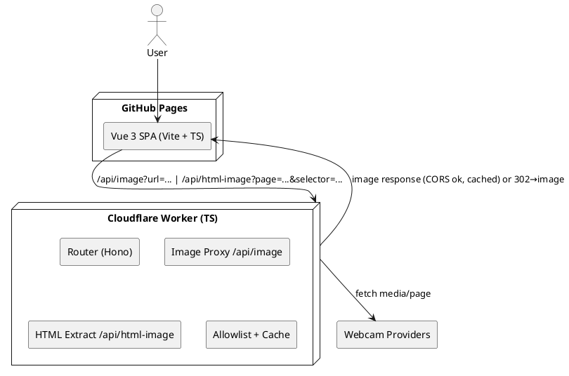

# SPEC-2-Webcam Sunline (Vue SPA + Cloudflare Worker)

## Background

You want a **GitHub Pages–hosted Vue 3 SPA** that aggregates webcams to determine at what **altitude the sun breaks above the fog layer** during fog season. We’ll implement a **Static + Edge Proxy** architecture (formerly Option B) using a **Cloudflare Worker** as a tiny normalize/cache/CORS layer. The SPA computes **distance and bearing from the user to each webcam**, and displays **webcam elevation**. All **coordinates are provided in Swiss grid (EPSG:2056 / CH1903+ / LV95)**, and the app uses simple planar math directly in that coordinate system.

We’ll prioritize **simplicity**, **local dev for both SPA and Worker**, and **SOLID principles** backed by strong automated tests and clear exceptions.

## Requirements

**Must**

* Host a **Vue 3 + Vite + TypeScript** SPA on **GitHub Pages**.
* Use a **Cloudflare Worker** proxy for CORS/header normalization and light HTML extraction.
* **YAML registry** includes for each webcam: `id`, `name`, `elevation_m_asl`, `coord_ch2056: { e, n }`, `source` (direct image/HLS/iframe/page), `attribution`, `refresh`.
* YAML has a **global settings** block with `user_coord_ch2056: { e, n }`, `units`, `worker_base_url`, and UI defaults.
* **All coordinates are EPSG:2056** (CH1903+ / LV95). SPA uses planar distance and bearing directly in that coordinate system.
* SPA shows **Name, Elevation, Distance (km), Bearing (°/compass)** for each webcam tile.
* **Local dev**: run SPA (`vite`) and Worker (`wrangler dev`) concurrently.
* **SOLID** codebase, **TypeScript-first**, explicit domain types, and **clear exceptions** with user-friendly messages.
* **Automated tests**: unit (Vitest), component (Vue Test Utils), e2e (Playwright), Worker tests (Miniflare + Vitest).

**Should**

* Filters/sorts: distance, elevation, bearing sector.
* Lightweight observability: per-webcam error counts, last refresh.

**Could**

* Brightness-based **sun/fog heuristic** per webcam (toggleable).
* Map view with bearings.

**Won’t**

* Heavy backends, archives, or ML.

## Method

### Architecture Overview (Static + Edge Proxy)



### Data Model (YAML)

```yaml
settings:
  user_coord_ch2056: { e: 2683400.0, n: 1245600.0 } # Swiss LV95 (EPSG:2056)
  units: metric
  worker_base_url: "http://127.0.0.1:8787" # dev via wrangler; prod: workers.dev

webcams:
  - id: hupplodge
    name: Hupp Lodge Axis
    elevation_m_asl: 1500 # TODO precise
    coord_ch2056: { e: 2730000.0, n: 1180000.0 } # TODO precise
    source: { kind: snapshot, url: "https://cam.hupplodge.ch:50001/axis-cgi/jpg/image.cgi?resolution=1280x720&compression=60&fps=1" }
    attribution: "Hupp Lodge"
    refresh: { seconds: 10 }

  - id: barmelweid
    name: Aussicht Barmelweid
    elevation_m_asl: 900 # TODO
    coord_ch2056: { e: 2640000.0, n: 1230000.0 } # TODO
    source: { kind: snapshot, url: "https://www.barmelweid.ch/aussicht_barmelweid/Bilder/LatestImage.jpg" }
    refresh: { seconds: 30 }

  - id: deinkick-solarb
    name: Deinkick Solarb
    elevation_m_asl: 1000 # TODO
    coord_ch2056: { e: 2600000.0, n: 1230000.0 } # TODO
    source: { kind: snapshot, url: "https://deinkick.ch/webcams/solarb_cam03-r.jpg" }
    refresh: { seconds: 30 }

  - id: deinkick-skil
    name: Deinkick Skil
    elevation_m_asl: 1000 # TODO
    coord_ch2056: { e: 2600000.0, n: 1230000.0 } # TODO
    source: { kind: snapshot, url: "https://deinkick.ch/webcams/skil_cam04.jpg" }
    refresh: { seconds: 30 }

  - id: windy
    name: Windy Webcam (provider embed required)
    elevation_m_asl: 0 # TODO
    coord_ch2056: { e: 0, n: 0 } # TODO
    source: { kind: iframe, url: "https://webcams.windy.com/" } # placeholder; requires official embed

  - id: inubis
    name: Känerkinden Webcams
    elevation_m_asl: 0 # TODO
    coord_ch2056: { e: 0, n: 0 } # TODO
    source: { kind: snapshot, url: "https://inubis.multipixx.net/currentPixx/17" }
    refresh: { seconds: 60 }

  - id: wasserflue
    name: Wasserflue Aarau
    elevation_m_asl: 0 # TODO
    coord_ch2056: { e: 0, n: 0 } # TODO
    source: { kind: snapshot, url: "https://webcam.wasserflue-aarau.ch/pos5.jpg" }
    refresh: { seconds: 60 }

  - id: roundshot-roggenberg
    name: Roggenberg Roundshot
    elevation_m_asl: 0 # TODO
    coord_ch2056: { e: 0, n: 0 } # TODO
    source: { kind: iframe, url: "https://roggenberg.roundshot.com/#/" }

  - id: seilpark-balmberg
    name: Seilpark Balmberg
    elevation_m_asl: 0 # TODO
    coord_ch2056: { e: 0, n: 0 } # TODO
    source: { kind: snapshot, url: "https://seilpark-balmberg.multipixx.net/currentPixx/19" }
```

### Coordinate Handling

* **EPSG:2056 (CH1903+ / LV95)** input only. Use planar distance and bearing in that coordinate system (no WGS84 conversion).

### API Contract (OpenAPI 3.1)

```yaml
openapi: 3.1.0
info:
  title: Webcam Sunline Worker API
  version: 1.0.0
servers:
  - url: http://127.0.0.1:8787
paths:
  /api/image:
    get:
      summary: Proxy an image with CORS and caching
      parameters:
        - in: query
          name: url
          required: true
          schema: { type: string, format: uri }
      responses:
        '200': { description: Image bytes, content: { '*/*': { schema: { type: string, format: binary } } } }
        '400': { description: Missing/invalid url }
        '403': { description: Forbidden host }
        '5XX': { description: Upstream error }
  /api/html-image:
    get:
      summary: Extract first matching  from a page then redirect to /api/image
      parameters:
        - in: query
          name: page
          required: true
          schema: { type: string, format: uri }
        - in: query
          name: selector
          required: false
          schema: { type: string, default: 'img' }
      responses:
        '302': { description: Redirects to /api/image?url=... }
        '400': { description: Missing page }
        '403': { description: Forbidden host }
        '404': { description: No matching image }
```

### UI Composition (Vue, SOLID)

* **Domain**: planar distance and bearing (pure TS, no framework deps).
* **Infrastructure**: `WorkerClient` (builds endpoint URLs) and `YamlConfigLoader`.
* **Application**: Pinia stores for settings, user location, webcams, and errors.
* **Presentation**: `WebcamCard.vue`, `Gallery.vue`, `LocationBar.vue`, `CompassBadge.vue`, `DistanceBadge.vue`.
* **Errors**: typed errors mapped to friendly UI toasts and card badges.

## Implementation

### Tooling & Libraries

* **Vue 3 + Vite + TypeScript** (SPA). Official TS setup via `create-vue`.
* **Pinia** for state; optional HLS support (if any).
* **Cloudflare Worker**: **TypeScript**, **Hono** router, **HTMLRewriter** with **Wrangler/Miniflare**.

### Projec([github.com](https://github.com/video-dev/hls.js?utm_source=chatgpt.com))/apps/spa/            # Vue 3 + Vite + TS

/apps/worker/         # Cloudflare Worker (TS + Hono)
/packages/domain/     # Pure T([developers.cloudflare.com](https://developers.cloudflare.com/workers/languages/typescript/?utm_source=chatgpt.com))  # YAML loader/validator (zod schema)
webcams.yml           # registry (EPSG:2056 coordinates + global settings)
pnpm-workspace.yaml

````

### YAML Schema (zod)
```ts
// packages/config/schema.ts
import { z } from 'zod';
export const chCoord = z.object({ e: z.number().finite(), n: z.number().finite() });
export const webcam = z.object({
  id: z.string().min(1), name: z.string().min(1),
  elevation_m_asl: z.number().int().nonnegative(),
  coord_ch2056: chCoord,
  source: z.object({
    kind: z.enum(['snapshot','hls','iframe','page']),
    url: z.string().url().optional(),
    page: z.string().url().optional(),
    selector: z.string().optional(),
  }).refine(s => (s.kind==='page'? !!s.page : !!s.url), { message:'source requires url or page' }),
  attribution: z.string().optional(),
  refresh: z.object({ seconds: z.number().int().positive() }).default({ seconds: 30 }),
});
export const settings = z.object({
  user_coord_ch2056: chCoord,
  units: z.enum(['metric','imperial']).default('metric'),
  worker_base_url: z.string().url(),
});
export const root = z.object({ settings, webcams: z.array(webcam).min(1) });
````

### Worker (Hono) – key routes

```ts
// /apps/worker/src/index.ts
import { Hono } from 'hono';
const app = new Hono();
const ALLOW = new Set(['cam.hupplodge.ch','www.barmelweid.ch','deinkick.ch','roggenberg.roundshot.com','seilpark-balmberg.multipixx.net','inubis.multipixx.net','webcam.wasserflue-aarau.ch']);

app.get('/api/image', async c => {
  const target = c.req.query('url'); if (!target) return c.text('Missing url', 400);
  const u = new URL(target); if (!ALLOW.has(u.hostname)) return c.text('Forbidden domain', 403);
  const r = await fetch(u.toString(), { cf:{ cacheTtl:30, cacheEverything:true }, headers:{ 'User-Agent':'WebcamSun/1.0', 'Referer': u.origin+'/' }});
  const h = new Headers(r.headers); h.set('Access-Control-Allow-Origin','*'); h.delete('Set-Cookie');
  return new Response(r.body, { status:r.status, headers:h });
});

app.get('/api/html-image', async c => {
  const page = c.req.query('page'); const selector = c.req.query('selector') || 'img';
  if (!page) return c.text('Missing page', 400);
  const u = new URL(page); if (!ALLOW.has(u.hostname)) return c.text('Forbidden domain', 403);
  const res = await fetch(page, { cf:{ cacheTtl:60, cacheEverything:true } });
  let found:string|undefined;
  const rewriter = new HTMLRewriter().on(selector, { element(el){ const src = el.getAttribute('src'); if (src && !found) found = new URL(src, page).toString(); }});
  await rewriter.transform(res).text();
  if (!found) return c.text('No image found', 404);
  return c.redirect(`/api/image?url=${encodeURIComponent(found)}`, 302);
});

export default app;
```

### Domain (planar geo)

```ts
export function planarDistanceKm(a:{e:number;n:number}, b:{e:number;n:number}) {
  const dx = b.e - a.e;
  const dy = b.n - a.n;
  return Math.hypot(dx, dy) / 1000;
}

export function planarBearingDeg(a:{e:number;n:number}, b:{e:number;n:number}) {
  const dx = b.e - a.e;
  const dy = b.n - a.n;
  const radians = Math.atan2(dx, dy);
  return (radians * 180) / Math.PI >= 0 ? (radians * 180) / Math.PI : (radians * 180) / Math.PI + 360;
}
```

### Local Development

* **Worker**: `cd apps/worker && wrangler dev --local`
* **SPA**: `cd apps/spa && pnpm dev`
* **Proxy**: Vite dev server proxies `/api/*` to Worker dev URL.

### Testing

* **Vitest** (unit), **Vue Test Utils** (components), **Playwright** (e2e), **Miniflare + Vitest** (Worker).
* CI: run `wrangler dev` headless and Vite preview; execute tests; enforce coverage.

### Exceptions & Messages

* `AppError` base with `code`, `message`, `hint`.
* Specific: `ConfigEr([developers.cloudflare.com](https://developers.cloudflare.com/workers/testing/miniflare/?utm_source=chatgpt.com))ror`, `ProxyError`, `ExtractionError`.
* UI shows concise toast; tile badges display error codes.

## Milestones

1. **Spec Split & Contracts** (this section) ✅
2. Shared packages scaffold (`packages/domain`, `packages/config`) with strict types + tests.
3. Worker skeleton with routing + allowlist; SPA skeleton with YAML loading + Pinia store.
4. Contract tests (SPA ↔ Worker) and CI gates.
5. Feature build-out in parallel; iterative PRs.

## Gathering Results

* Contract tests green (endpoints, headers, error codes).
* Per-webcam tile shows correct **name, elevation, distance, bearing** given a fixed test `user_coord_ch2056`.
* Worker returns images within target TTL; CORS headers present; allowlist enforced.
* Planar distance/bearing math verified against known reference points in CH.

---

# Parallel Work Split (for two AI agents)

### Goal

Enable **independent development** of the **Worker** and the **SPA**, with a tight, testable interface and minimal cross-churn.

### Split

* **Worker Agent (Edge Proxy)**

  * Owns: `/api/image`, `/api/html-image` routes, allowlist, caching, HTML extraction.
  * Tech: TypeScript, Hono, HTMLRewriter, Wrangler/Miniflare.
  * Deliverables: Deployed Worker URL, OpenAPI spec, contract tests, env sample.
* **SPA Agent (Vue)**

  * Owns: YAML parsing/validation, projection & geo math usage, UI, polling, error handling.
  * Tech: Vue 3 + Vite + TS, Pinia, SunCalc, proj4.
  * Deliverables: Gallery UI, Pinia stores, YAML loader, integration tests.
* **Shared** (`packages/`)

  * `domain`: pure TS utilities (projection, haversine, bearing, units, compass sectors).
  * `config`: zod schema + loader for `webcams.yml`.

### API Contract (frozen for parallel work)

* `GET /api/image?url=<https-url>`

  * **200**: `image/*` body; headers: `Access-Control-Allow-Origin: *`, `Cache-Control: max-age=NN`.
  * **4xx/5xx**: JSON error `{ code, message, hint }` with `Content-Type: application/json`.
  * **Security**: hostname allowlist; strips cookies.
* `GET /api/html-image?page=<https-url>&selector=<css>`

  * **302 → /api/image?url=...** on success.
  * **404** on no match; **403** if host not allowlisted.

### Error Codes (shared)

* `E_FORBIDDEN_HOST` (403), `E_MISSING_PARAM` (400), `E_NO_IMAGE_FOUND` (404), `E_UPSTREAM_FAILED` (502), `E_INVALID_URL` (400).

### YAML Contract (frozen)

```yaml
settings:
  user_coord_ch2056: { e: number, n: number }
  units: metric|imperial
  worker_base_url: string
webcams: Webcam[]
```

`Webcam` fields: `id`, `name`, `elevation_m_asl`, `coord_ch2056:{e,n}`, `source:{ kind: snapshot|hls|iframe|page, url?, page?, selector? }`, `attribution?`, `refresh:{seconds}`.

### Versioning & CI gates

* **Semver** tags per package (`domain`, `config`, `apps/worker`, `apps/spa`).
* **Contract tests** run in SPA CI against local Miniflare Worker; PRs that break contract **fail**.
* **OpenAPI** (YAML) checked-in for Worker; SPA uses it to generate a tiny client (optional).

### Local Dev Story

* `pnpm dev` → runs **Vite** (`apps/spa`) and **Miniflare** (`apps/worker`) concurrently; Vite proxies `/api/*` to Worker.
* Seed `webcams.yml` placed at repo root; SPA hot-reloads.

### SOLID & Exceptions

* **Worker**: controllers → services → gateways (fetch), each with interfaces to enable unit tests; throw typed errors mapped to HTTP.
* **SPA**: service abstractions (`MediaSource`, `GeoService`, `ConfigService`); components depend on interfaces; catch errors at boundaries; user-friendly toasts.
